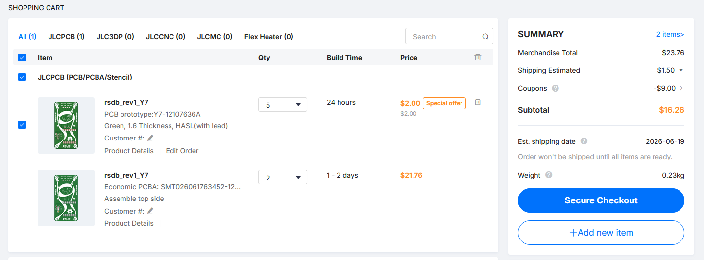

# RSdB
RSdB (rim shot dB) is a general usage dB meter with an OLED display, powered by the MEMS MSM261DGT003 and a seeed XIAO RP2040.

Firmware can be found at firmware/mic_db_meter.

## BOM

| Item | Quantity | Price | Funding required | Link |
| :---: | :---: | :---: | :---: | :---: |
| PCB | 1 | 16.26\* | Yes | [JLCPCB](https://jlcpcb.com/) |
| SSD1306 128×64 Mono 0.96 Inch I2C OLED Display | 1 | - | No | None |
| Seeed Studio XIAO RP2040  | 1 | - | No | None |

\* Note that price might fluctuate based on LCSC component prices, and the availability of coupons at the time of purchase. Includes PCBA.